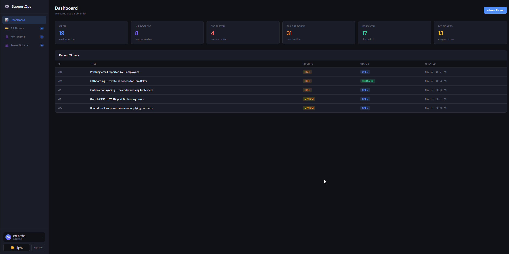
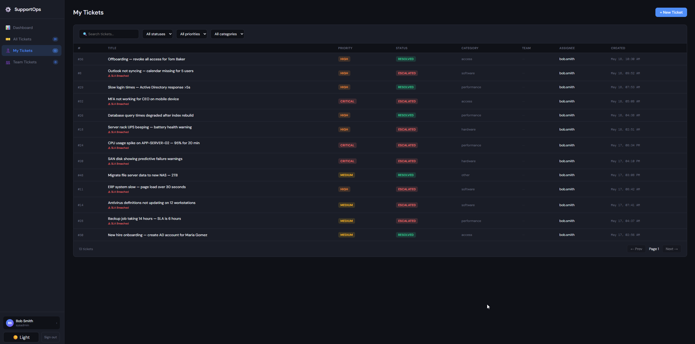
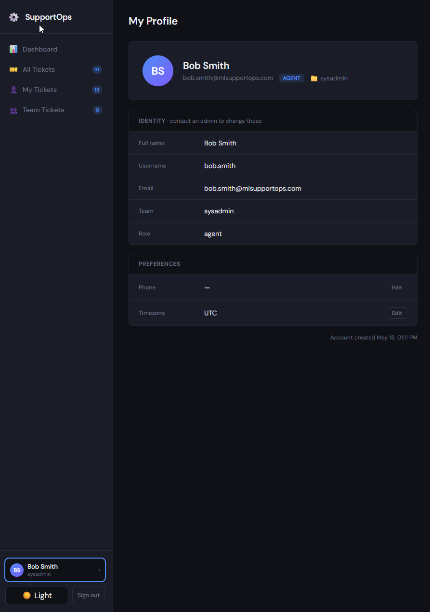
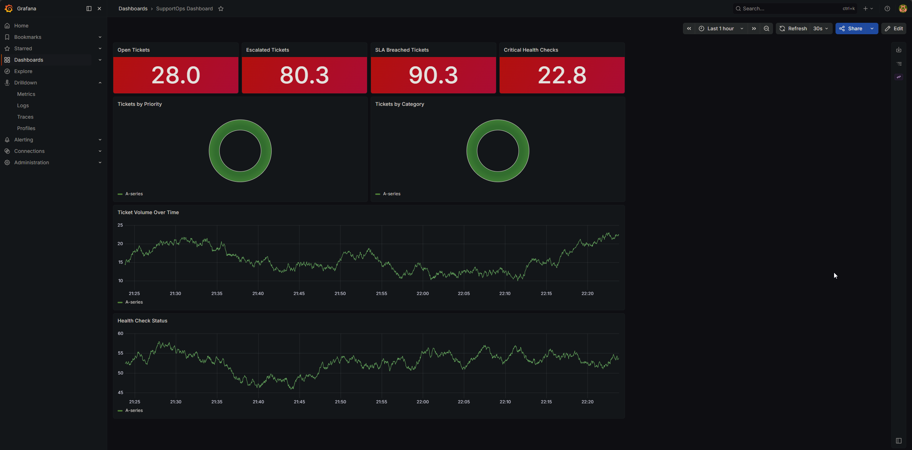

# 🛠️ SupportOps Toolkit


> A production-style IT support automation system built with Python, FastAPI, SQL Server, Docker, and Grafana.  
> Simulates real-world workflows: auto-ticketing, SLA escalation, health monitoring, and observability dashboards.

---

## 📌 What This Project Does

SupportOps Toolkit automates the repetitive work of a Technical Support Engineer:

| Module | Description |
|---|---|
| 🔍 **Health Monitor** | Polls system/service health and logs metrics to SQL Server |
| 🎫 **Auto-Ticketing** | Detects incidents and opens tickets automatically |
| ⏫ **Escalation Engine** | Escalates tickets that breach SLA thresholds |
| 🌐 **REST API** | FastAPI interface to manage tickets (like a mini Ticketing System) |
| 🖥️ **Web UI** | React SPA served by FastAPI — full ticket management without Swagger |
| 📊 **Reports** | SQL-based reports + live charts: resolution time, volume trends, SLA compliance |
| 📈 **Observability** | Prometheus + Grafana dashboard with live ticket and health check metrics |
| 🔔 **Slack Alerts** | Webhook notifications for critical tickets, SLA breaches, and escalations |

Everything runs locally via **Docker Compose** — no paid cloud services needed.

---

## 🏗️ Architecture

```
┌──────────────────────────────────────────────────────────────────┐
│                        Docker Network                            │
│                                                                  │
│  ┌─────────────┐      ┌───────────────────────┐                  │
│  │  SQL Server │◄─────│   FastAPI (port 8000) │                  │
│  │    2025     │      │   REST API + Logic    │                  │
│  │  port 1433  │      └──────────┬────────────┘                  │
│  └─────────────┘                 │                               │
│                         ┌────────▼────────┐                      │
│                         │  Python Scripts │                      │
│                         │  (schedulers)   │                      │
│                         └────────┬────────┘                      │
│                                  │ /metrics                      │
│                         ┌────────▼────────┐    ┌─────────────┐   │
│                         │   Prometheus    │───►│   Grafana   │   │
│                         │   port 9090     │    │  port 3000  │   │
│                         └─────────────────┘    └─────────────┘   │
└──────────────────────────────────────────────────────────────────┘
```

---

## 🚀 Quick Start

### Prerequisites
- Docker + Docker Compose
- Python 3.10+ (for running scripts outside Docker)

### 1. Clone and start

```bash
git clone https://github.com/mgjlopez/supportops-toolkit.git
cd supportops-toolkit
cp .env.example .env
docker compose up -d
```

### 2. Wait ~30 seconds for SQL Server to initialize, then run migrations

```bash
docker compose exec api python db/migrate.py
```

### 3. Seed sample data (optional)

```bash
docker compose exec api python db/seed.py
```

To re-seed without losing users or lookups (e.g. after testing):
```bash
docker compose exec api python db/seed.py --force
```

### 4. Access the services

| Service | URL | Credentials |
|---|---|---|
| **Web UI** | http://localhost:8000/ui | See demo users below |
| **API Swagger UI** | http://localhost:8000/docs | — |
| **API Health check** | http://localhost:8000/health | — |
| **Prometheus** | http://localhost:9090 | — |
| **Grafana** | http://localhost:3000 | admin / (set in `.env`) |

---

## 📁 Project Structure

```
supportops-toolkit/
├── api/                        # FastAPI application
│   ├── main.py                 # App entrypoint + serves /ui from frontend/dist/
│   ├── models.py               # SQLAlchemy ORM models
│   ├── schemas.py              # Pydantic request/response models
│   ├── database.py             # SQLAlchemy + SQL Server connection
│   ├── auth.py                 # JWT: hash_password, verify_password, get_current_user
│   ├── logger.py               # JSON structured logging
│   ├── metrics.py              # Custom Prometheus metrics
│   └── routers/
│       ├── auth.py             # POST /auth/login, GET /auth/me
│       ├── tickets.py          # Ticket CRUD + /stats + /lookup-values
│       └── reports.py          # Reporting endpoints
├── automation/                 # Core automation scripts
│   ├── health_monitor.py       # System health checks → auto-tickets + Slack alerts
│   ├── escalation_engine.py    # SLA breach detection + escalation + Slack alerts
│   ├── slack_notifier.py       # Slack Block Kit webhook integration
│   └── scheduler.py            # Runs monitor + escalation on a schedule
├── frontend/
│   └── dist/
│       └── index.html          # React SPA (single file, no build step required)
├── monitoring/                 # Observability configuration
│   ├── prometheus.yml          # Prometheus scrape config
│   └── grafana/
│       ├── datasources/        # Auto-configured Prometheus datasource
│       └── dashboards/         # Pre-built SupportOps dashboard
├── db/
│   ├── migrate.py              # Schema creation + lookup seeding + demo users
│   └── seed.py                 # 50 sample tickets assigned to real users/teams
├── docs/
│   ├── runbook.md              # Incident response runbook
│   └── SupportOps.postman_collection.json
├── tests/
│   └── test_tickets.py        # API endpoint tests (SQLite, no SQL Server needed)
├── k8s/                        # Kubernetes manifests (minikube)
├── docker-compose.yml
├── Dockerfile
├── requirements.txt
└── .env.example
```

---

## 🔧 Key Features Explained

### Health Monitor
Runs on a schedule (every 60s). Checks:
- HTTP endpoints (configurable list)
- Port availability (TCP check)
- Disk usage thresholds
- CPU/RAM thresholds

When a check fails, it automatically creates a ticket with severity based on the failure type.

### Escalation Engine
Reads open tickets and checks age vs. SLA rules:

| Priority | Response SLA | Resolution SLA |
|---|---|---|
| Critical | 15 min | 1 hour |
| High | 1 hour | 4 hours |
| Medium | 4 hours | 24 hours |
| Low | 24 hours | 72 hours |

Breached tickets get escalated and flagged in the database.

### Web UI

A single-page React app is served by FastAPI at `/ui` — no build step or separate server needed. It provides a full ticket management interface without touching Swagger.

**Demo users** (created by `migrate.py`):

| Username | Password | Team | Role |
|---|---|---|---|
| admin | admin123 | — | admin |
| alice.jones | pass123 | network.team | agent |
| bob.smith | pass123 | sysadmin | agent |
| carol.white | pass123 | helpdesk | agent |
| dave.sec | pass123 | security | agent |
| eve.devops | pass123 | devops | agent |
| frank.field | pass123 | field.support | agent |





**Features:**

- **Dashboard** — stat cards + 4 live charts: volume trend (7/14/30d), tickets by category, SLA compliance, and resolution time by priority
- **All Tickets** — sortable columns, filterable by status, priority, category; full-text search
- **My Tickets** — tickets assigned to the logged-in user
- **Team Tickets** — tickets assigned to the user's team
- **Ticket detail** — inline status, team, and assignee editing without closing the modal
- **Team + Assignee dropdowns** — assignee list filters to members of the selected team
- **Notes system** — add comments per ticket; notes are shown separately from the audit trail
- **Resolve flow** — dedicated Resolve button (replaces Delete) that requires a resolution note
- **Create / Edit** — full form with cascading team → assignee dropdowns and toast feedback
- **Sidebar badges** — live ticket counts per view, updated after every mutation
- **User profile** — edit phone and timezone; admins can edit any user's name and email
- **Dark / Light mode** — toggle in the sidebar
- **JWT auth** — token stored in localStorage; auto-redirects on expiry

The UI is a single file at `frontend/dist/index.html`, tracked in git and served statically. No npm, no webpack, no build pipeline.

---

### REST API Endpoints

```
POST   /auth/login              Authenticate and receive a JWT token
GET    /auth/me                 Get the current user's profile
PATCH  /auth/me                 Update own phone and timezone
PATCH  /auth/users/{id}         Admin: update any user's name, email, phone, timezone

GET    /tickets                 List all tickets (filterable by status, priority, category, assignee, team)
POST   /tickets                 Create a ticket manually
GET    /tickets/{id}            Get ticket detail with full audit trail and notes
PATCH  /tickets/{id}            Update status, assignee, team, priority
DELETE /tickets/{id}            Delete a ticket
POST   /tickets/{id}/events     Add a note or audit event to a ticket
GET    /tickets/stats           Ticket counts for dashboard cards
GET    /tickets/lookup-values   All dropdown values including teams and their members

GET    /reports/summary         Ticket volume by category
GET    /reports/sla             SLA compliance rate by priority
GET    /reports/resolution      Average resolution time by priority
GET    /reports/trend           Daily ticket volume for the last N days (used by trend chart)
GET    /health                  Service health check
GET    /metrics                 Prometheus metrics endpoint
```

### Observability — Prometheus + Grafana



The API exposes a `/metrics` endpoint that Prometheus scrapes every 15 seconds. Grafana reads from Prometheus and displays a pre-built dashboard with:

- **Open / Escalated / SLA-breached ticket counts** — color-coded stat panels
- **Tickets by priority** — donut chart
- **Tickets by category** — donut chart
- **Ticket volume over time** — time series
- **Health check results over time** — time series by check type

The dashboard is provisioned automatically on startup — no manual setup needed.

### Normalized Database Schema

Priority, status, category and source values are stored in their own lookup tables with foreign keys, enforcing valid values at the database level. Invalid values return a descriptive `400` error. Tickets also carry a `team_id` and `assignee_id` FK to support structured team-based assignment.

```
ticket_priorities ──┐
ticket_statuses   ──┤──► tickets ──► ticket_events
ticket_categories ──┤      │
ticket_sources    ──┘    team_id ──► teams ──► users
                       assignee_id ──────────────┘
```

---

### 🔔 Slack Alerts

The escalation engine and health monitor send structured **Block Kit** messages to a Slack channel via webhook. No paid plan required — any Slack workspace supports incoming webhooks.

**Three alert types:**

| Trigger | When |
|---|---|
| 🔴 New critical/high ticket | Health monitor auto-creates a ticket |
| ⚠️ SLA breach | First time a ticket exceeds its SLA window |
| ⏫ Escalation | Each time the escalation engine escalates a ticket |

**Setup:**
1. Go to [api.slack.com/apps](https://api.slack.com/apps) → Create App → Incoming Webhooks → Add Webhook
2. Add to `.env`:
```
SLACK_WEBHOOK_URL=https://hooks.slack.com/services/T.../B.../...
```
3. `docker compose restart scheduler`

If `SLACK_WEBHOOK_URL` is empty, all notifications are silently skipped — no errors, no impact on the rest of the system.

---

## 🧪 Running Tests

```bash
docker compose exec api pytest tests/ -v
```

Tests use an in-memory SQLite database — no SQL Server required to run them.

---

## 📖 Runbook

See [`docs/runbook.md`](docs/runbook.md) for the incident response guide covering:
- Performance alerts (CPU, disk, RAM)
- Network alerts (HTTP endpoints, VPN)
- Security alerts (SSL expiry, unknown processes)
- Hardware alerts
- SLA escalation matrix
- Ticket closure procedure

---

## 💡 Why This Project?

This toolkit replicates patterns used in enterprise support environments (ServiceNow, Jira Service Management, PagerDuty) but built from scratch to demonstrate:

- **Database design** — normalized schema with lookup tables, foreign key constraints, and relational team/user assignment
- **Automation thinking** — detecting problems before users report them
- **API design** — clean REST conventions, proper status codes, input validation
- **SLA awareness** — a core concept in any support role
- **Observability** — Prometheus metrics and Grafana dashboards like production environments use
- **Data visualization** — interactive charts (trend, SLA compliance, resolution time) built with Recharts
- **Third-party integrations** — Slack webhook alerts using Block Kit, same pattern as PagerDuty/OpsGenie
- **Docker fluency** — full stack runs with a single `docker compose up`

I wrote this project to deepen my knowledge of Docker, Python, and infrastructure observability as part of my continuing my journey as a Technical Support Engineer.

---

## 📄 License

MIT — use freely, attribution appreciated.

---

## 🔬 Structured Logging

All services emit **JSON-formatted logs** compatible with log aggregators like Datadog, Splunk, ELK, and CloudWatch.

Every log line is a structured object:

```json
{"timestamp": "2026-05-12T10:00:00Z", "level": "INFO", "module": "api.routers.tickets",
 "message": "Ticket created", "ticket_id": 42, "priority": "high", "category": "network"}
```

The HTTP middleware logs every request automatically:

```json
{"timestamp": "2026-05-12T10:00:01Z", "level": "INFO", "module": "api.main",
 "message": "HTTP request", "method": "POST", "path": "/tickets",
 "status_code": 201, "duration_ms": 14.3}
```

View live logs from any service:

```bash
docker compose logs api -f
docker compose logs scheduler -f
```

---

## 📬 Postman Collection

A full Postman collection is available in [`docs/SupportOps.postman_collection.json`](docs/SupportOps.postman_collection.json).

**Import it:**
1. Open Postman → Import → select the file
2. Set the `base_url` variable to `http://localhost:8000`
3. Run the collection with the Collection Runner

**What it covers:**

| Folder | Requests |
|---|---|
| Authentication | Login (saves token), wrong password, unknown user, GET /me, invalid token, PATCH /me |
| System | Health check, Prometheus metrics |
| Tickets | List, filter, create, update, resolve, delete, add note |
| Reports | Summary, SLA compliance, resolution time, trend, health check log |

Each request includes **automated tests** that verify status codes and response structure — run the full collection to validate the entire API in one click.

---

## ☸️ Kubernetes Deployment

The `k8s/` folder contains manifests to deploy the full stack on a local Kubernetes cluster using **minikube** (free, runs on your machine).

```
k8s/
├── namespace.yml    # Isolates all resources under the 'supportops' namespace
├── secret.yml       # DB credentials stored as a Kubernetes Secret
├── sqlserver.yml    # SQL Server deployment + PersistentVolumeClaim + Service
├── api.yml          # FastAPI deployment (2 replicas) + Service
├── scheduler.yml    # Background automation (single replica)
├── ingress.yml      # Exposes the API via nginx ingress
└── README.md        # Step-by-step setup guide
```

Key concepts demonstrated:

- **Namespaces** — resource isolation
- **Secrets** — credentials never in plain text
- **Deployments** — declarative replica management
- **Services** — internal DNS between pods
- **Liveness/Readiness probes** — automatic health checking
- **PersistentVolumeClaim** — database storage that survives pod restarts
- **Ingress** — single entry point for external traffic

See [`k8s/README.md`](k8s/README.md) for the full setup guide.
